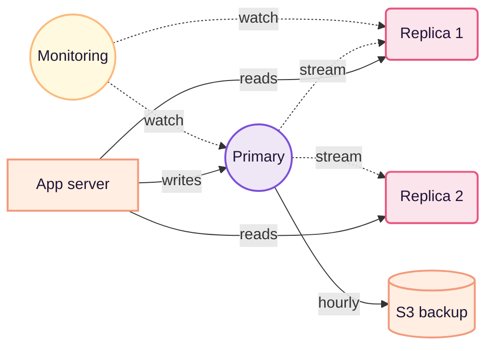

import BarChart from '../../../components/BarChart.astro';

Most weeks I don't touch Postgres. In the weeks I do touch it, I'm almost always solving the same kind of problem: a query that was fast at a hundred thousand rows and isn't at ten million. The pattern is so repetitive I started wondering if it wasn't the same query wearing a different hat.

In five years of keeping this database alive, three things stand out. The first two are about the ordinary. The third — the architecture — is the scariest but also the most stable.

## A year of slow queries

The first step is to stop looking at the CPU graph and start looking at the queries. Ninety percent of the time I thought «Postgres is slow» was a single query re-running a non-indexed JOIN. When I found that out, I stopped adding hardware.

The cheapest way to find it is pg_stat_statements. I know, it's not new. But nobody uses it until it's too late.

```sql
SELECT query, mean_exec_time, calls
FROM pg_stat_statements
ORDER BY total_exec_time DESC
LIMIT 20;
```

*How I measure «slow» — it isn't always about grabbing the p95.*

## Latency by index type

<BarChart
  fig="01"
  title="p95 latency by index"
  meta="n≈1.2M rows"
  unit="ms"
  data={[
    { label: 'btree', value: 12 },
    { label: 'hash', value: 18 },
    { label: 'gin', value: 34 },
    { label: 'gist', value: 42 },
    { label: 'brin', value: 68 },
  ]}
  caption="Real comparison, obfuscated data. Btree stays the most predictable — the rest I only use when I know why."
/>

It isn't a race. It's a mental checklist: if I'm about to use something more exotic than a btree, I want to know why. Nine times out of ten the answer is «no need».

## The architecture, today



*FIG. 02 — no engineer has ever been fired for buying a second read replica.*

> The boring thing about Postgres is its best feature: it's there, when you come back, the way you left it.

## What I wouldn't do again

1. Rewrite a long migration in a single transaction. Better in chunks, even if it needs more code — production thanks you.
2. Trust autovacuum without monitoring it. Sometimes it works, sometimes it just walks — and you find out when the disk fills up.
3. Add an index «just to be safe». If it doesn't fix a real query, it's debt you'll pay in write throughput.
