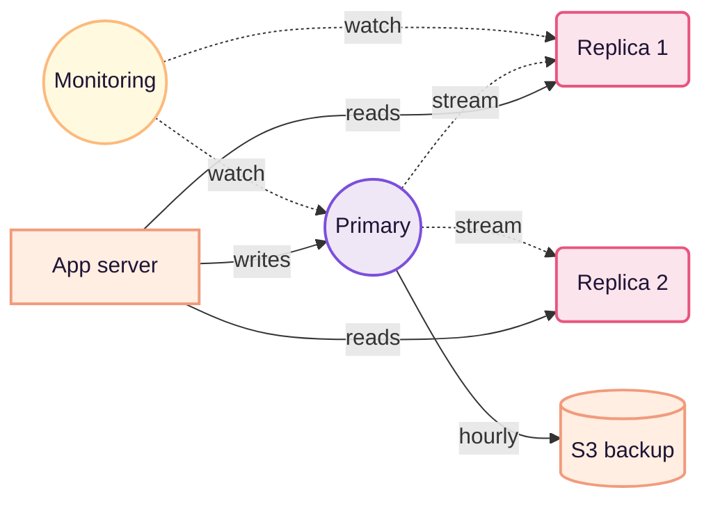

import BarChart from '../../../components/BarChart.astro';

Nella maggior parte delle settimane non tocco Postgres. Nelle settimane in cui lo tocco, quasi sempre sto risolvendo lo stesso tipo di problema: una query che era veloce a centomila righe e non lo è più a dieci milioni. Il pattern è così ripetitivo che ho iniziato a chiedermi se non fosse la stessa query travestita da un'altra.

Nei cinque anni in cui ho tenuto vivo questo database, ho imparato tre cose che vale la pena scrivere. Le prime due riguardano l'ordinario. La terza — l'architettura — è quella che spaventa di più ma è anche la più stabile.

## Un anno di query lente

Il primo passo è smettere di guardare il grafico di CPU e iniziare a guardare le query. Il novanta per cento del tempo che pensavo fosse «Postgres lento» era una singola query che rieseguiva un JOIN non indicizzato. Quando l'ho scoperto ho smesso di aggiungere hardware.

Il modo più economico per trovarla è pg_stat_statements. Lo so, non è nuovo. Ma non lo usa nessuno finché non è troppo tardi.

```sql
SELECT query, mean_exec_time, calls
FROM pg_stat_statements
ORDER BY total_exec_time DESC
LIMIT 20;
```

*Il modo in cui misuro «lento» — non è sempre prendere il p95.*

## Latenza per tipo di indice

<BarChart
  fig="01"
  title="Latenza p95 per index"
  meta="n≈1.2M righe"
  unit="ms"
  data={[
    { label: 'btree', value: 12 },
    { label: 'hash', value: 18 },
    { label: 'gin', value: 34 },
    { label: 'gist', value: 42 },
    { label: 'brin', value: 68 },
  ]}
  caption="Confronto reale, dati offuscati. Btree resta il più prevedibile — il resto lo uso solo quando so perché."
/>

Non è una gara. È una checklist mentale: se sto per usare qualcosa di più esotico di un btree, voglio sapere perché. Nove volte su dieci la risposta è «non ce n'è bisogno».

## L'architettura, oggi



*FIG. 02 — nessun ingegnere è mai stato licenziato per aver comprato una seconda replica di lettura.*

> La cosa noiosa di Postgres è la sua feature migliore: è lì, quando torni, uguale a come l'hai lasciato.

## Cosa non farei più

1. Riscrivere una migrazione lunga in una sola transazione. Meglio in chunk, anche se serve più codice — la produzione ringrazia.
2. Fidarmi di autovacuum senza monitorarlo. A volte lavora, a volte solo cammina — e te ne accorgi solo quando il disco si riempie.
3. Aggiungere un indice «giusto per sicurezza». Se non risolve una query concreta, è debito che devi poi pagare in write-throughput.
